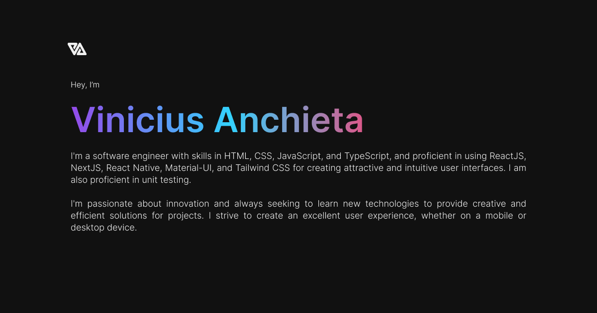

<h1 align="center">Personal Website</h1>

<p align="center" margin-top="25px" >
  
  

  

  
</p>

## About

This repository contains the code for my personal website, which has been updated using Next.js v13 / React, Tailwind CSS, Framer Motion, Jest and Testing Library, Typescript, and following Domain-Driven Design (DDD) principles.

## Structure

The structure of the project is based on the DDD (Domain Driven Design) pattern, where the domain is divided into layers, each with its own responsibility.
Layers:

- Application: responsible for the application's business rules.
- Domain: responsible for creating the domain entities.
- Infra: responsible for the data access layer.
- Main: responsible for the application's entry point.
- Presentation: responsible for the application's presentation layer.

## Technologies

This project was developed with the following technologies:

- [React](https://reactjs.org)
- [Next.js](https://nextjs.org)
- [TypeScript](https://www.typescriptlang.org)
- [Tailwind CSS](https://tailwindcss.com)
- [Framer Motion](https://www.framer.com/motion)
- [Jest](https://jestjs.io)
- [Testing Library](https://testing-library.com)
- [NPM](https://www.npmjs.com)

## Getting started

Clone the project and access the folder.

```bash
$ cd viniciusanchieta.dev
```

Follow the steps below:

```bash
# Install the dependencies
$ npm install
```

```bash
# Start the project
$ npm run dev
```

Extra step for running tests:

```bash
# Run the tests
$ npm run test
```

Coverages:

```bash
# Run the tests
$ npm run test:ci
```

## Contributors

[](https://github.com/viniciusanchieta/viniciusanchieta.dev/graphs/contributors)

## License

This project is under the MIT license. See the [LICENSE](LICENSE.md) file for more details.
